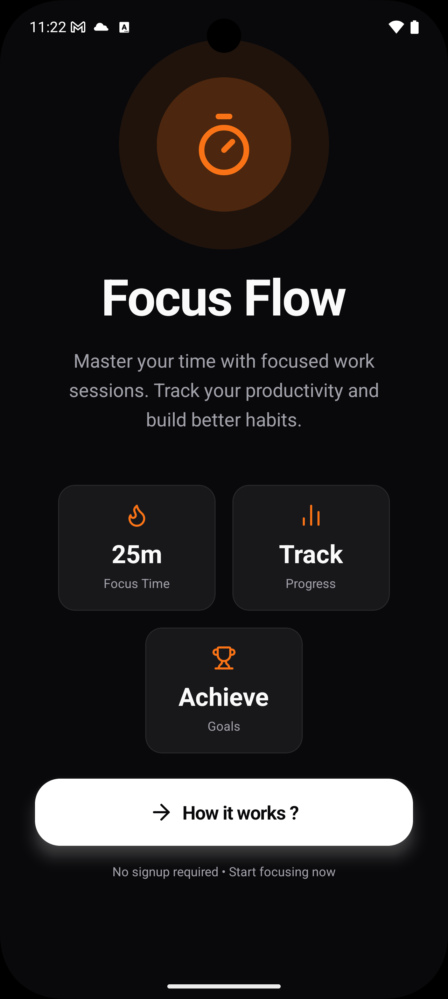
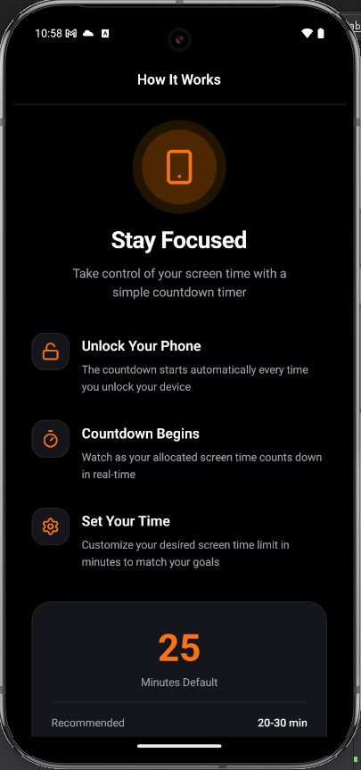
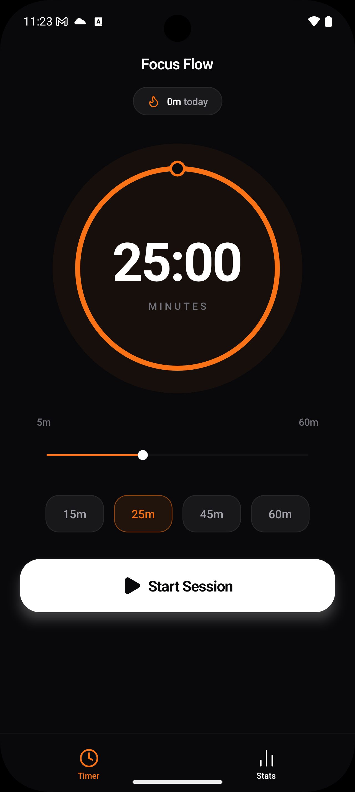
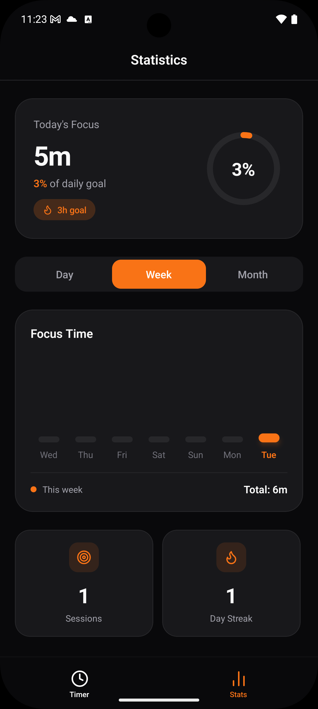
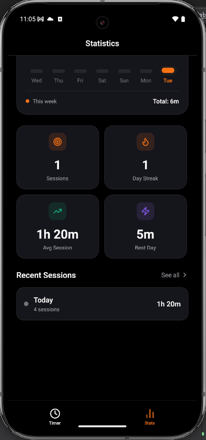
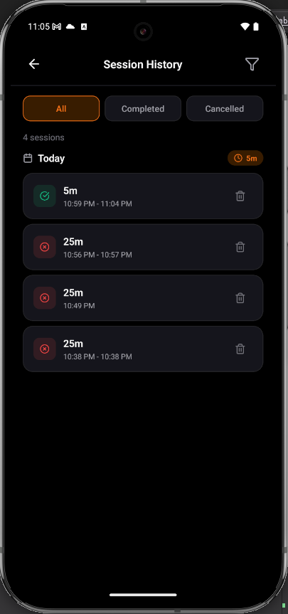

# FocusFlow

A Full Local timer to remind you to forget your phone and focus on things that actually matters. The countdown starts every time you unlock your phone. Free code, no backdoors or any sort of tracking / online metrics.

## Screenshots

<p>
  
  &nbsp;&nbsp; &nbsp;&nbsp; &nbsp;&nbsp;
  
  &nbsp;&nbsp; &nbsp;&nbsp; &nbsp;&nbsp;
  
  &nbsp;&nbsp; &nbsp;&nbsp; &nbsp;&nbsp;
  
  &nbsp;&nbsp; &nbsp;&nbsp; &nbsp;&nbsp;
  
  &nbsp;&nbsp; &nbsp;&nbsp; &nbsp;&nbsp;
  
</p>

## Features

- ⏱️ **Customizable Timer** - Set focus sessions from 5 to 60 minutes with preset options (15, 25, 45, 60 minutes)
- 🔒 **Device Lock Detection** - Automatically resets your session when you unlock your phone, keeping you accountable
- 📊 **Progress Tracking** - View detailed statistics and track your daily, weekly, and overall progress
- 🎯 **Focus Sessions** - Complete focused work sessions with visual circular progress indicators
- 🔥 **Streak Tracking** - Maintain your focus streak and stay motivated with daily stats
- 📳 **Vibration Feedback** - Get haptic feedback when your timer completes
- 🌓 **Dark Mode** - Eye-friendly dark theme optimized for extended focus sessions
- 💾 **Fully Local** - All data stored locally with SQLite, works completely offline
- 📱 **Native Android** - Built with React Native for optimal performance

## Tech Stack

- **React Native** - Mobile framework (v0.82.1)
- **TypeScript** - Type-safe development
- **SQLite** - Local data persistence (react-native-sqlite-storage)
- **React Navigation** - Navigation library
- **Lucide React Native** - Beautiful icon set
- **React Native SVG** - Vector graphics support
- **AsyncStorage** - Persistent key-value storage
- **Custom Native Module** - Device lock/unlock detection

## Getting Started

### Prerequisites

- Node.js (v16 or higher)
- npm or yarn
- Android Studio (for Android development)
- Java Development Kit (JDK 17 or higher)
- Android SDK

### Installation

1. Clone the repository:

```bash
git clone <your-repo-url>
cd FocusFlow
```

2. Install dependencies:

```bash
npm install
# or
yarn install
```

3. Start the development server:

```bash
npm start
# or
yarn start
```

4. Run on Android:

```bash
npx react-native run-android
```

### Running on Different Platforms

- **Android**: Run `npx react-native run-android` (requires Android device/emulator)

## Project Structure

```
FocusFlow/
├── android/                    # Android native code
│   └── app/
│       └── src/main/
│           └── java/com/focusflow/
├── App.tsx                     # Root component with navigation
├── screens/                    # App screens
│   ├── TimerScreen.tsx        # Main timer interface
│   ├── StatsScreen.tsx        # Statistics and analytics
│   ├── SessionsScreen.tsx     # Session history
│   ├── WelcomeScreen.tsx      # Welcome screen
│   └── OnboardingScreen.tsx   # Onboarding flow
├── hooks/
│   └── app.hook.ts            # Timer and stats hooks
├── services/
│   └── app.service.ts         # Database and business logic
├── contexts/
│   └── TimerContext.tsx       # Global timer state management
├── modules/
│   └── device-unlock/         # Native module for lock/unlock detection
│       ├── android/           # Android implementation
│       ├── ios/               # iOS implementation (future)
│       ├── index.ts           # JavaScript bridge
│       └── useDeviceUnlock.ts # React hook
├── constants/
│   └── Colors.ts              # Color scheme
└── components/                # Reusable UI components
```

## Key Features Explained

### Device Lock Detection

The app includes a custom native module that detects when you lock and unlock your Android device:

- **On Lock**: Timer continues running in the background (tracked by timestamp)
- **On Unlock**: Current session is automatically cancelled (not recorded in database) and a new session starts with the same duration
- **Accountability**: Encourages you to stay away from your phone during focus sessions

### Timer Mechanism

- Uses timestamp-based countdown that continues even when app is in background
- Vibrates when session completes
- Automatically saves completed sessions to local database
- Global state management using React Context for real-time UI updates

### Statistics & Analytics

- **Today's Stats**: Total focus time and session count
- **Weekly Chart**: Visual bar chart of daily focus hours
- **Overall Stats**: Total sessions, average session length, current streak
- **Session History**: Detailed list of recent sessions

## Key Screens

- **Welcome Screen**: Introduction to FocusFlow features
- **Onboarding**: Quick setup and tutorial
- **Timer Screen**: Main timer interface with circular progress indicator
- **Stats Screen**: Detailed productivity analytics and charts
- **Sessions Screen**: Complete session history

## Customization

### Colors

Edit `constants/Colors.ts` to customize the app's color scheme:

```typescript
export default {
  dark: {
    background: '#09090b',
    primary: '#f97316',
    // ... more colors
  },
  light: {
    // Light mode colors
  },
};
```

## Development

### Scripts

- `npm start` - Start the Metro bundler
- `npx react-native run-android` - Build and run on Android device/emulator
- `adb logcat` - View Android logs for debugging

### Building for Production

```bash
cd android
./gradlew assembleRelease
```

The APK will be generated at `android/app/build/outputs/apk/release/app-release.apk`

## Privacy & Security

- **100% Local**: All data stored locally on your device using SQLite
- **No Internet Required**: Works completely offline
- **No Tracking**: Zero analytics, metrics, or user tracking
- **No Permissions Abuse**: Only requires VIBRATE permission for haptic feedback
- **Open Source**: Full transparency - review the code yourself

## License

0BSD - Zero-Clause BSD License (Public Domain Equivalent)

## Contributing

Contributions are welcome! Please feel free to submit a Pull Request.

## Support

For issues and questions, please open an issue on GitHub.
